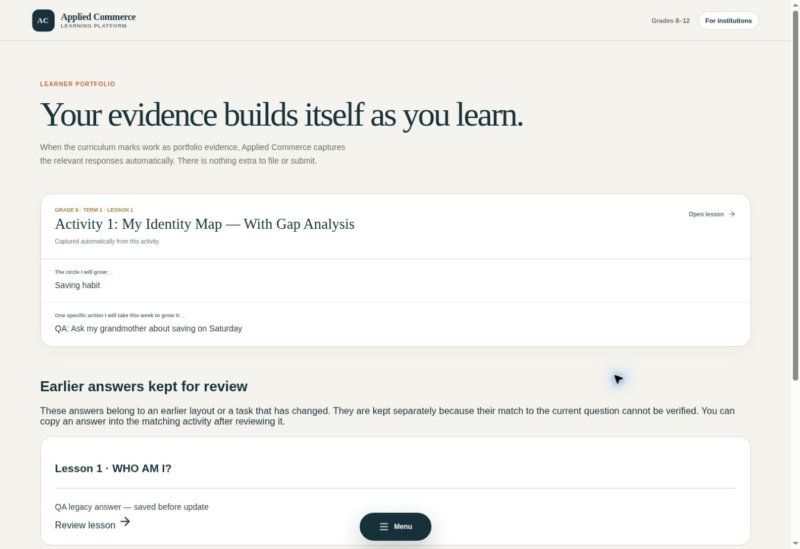

# Learner response and portfolio milestone — 4 October 2026

The learner task → saved answer → portfolio path now uses task identities instead of positions in the document. The app remains local-first; this milestone does not enable accounts, cloud sync or educator access.

## Behaviour

- New answers persist under a compiled block identity and field slot. Moving unrelated content before a question does not attach the answer to another question.
- Identity derives from task context, block kind/type and exact content, with an occurrence suffix for identical repeats. Editing a question or table deliberately creates a new identity. Identical duplicate prompts inserted/reordered inside the same task still require editorial review; this scheme does not infer author intent.
- The renderer uses a temporary positional view for its field widgets; that positional view is never persisted.
- Portfolio assembly resolves saved identities against current blocks. Answers to changed or removed blocks in an existing lesson remain visible in the earlier-answer section.
- Version 1 answers have no authoritative original question snapshot. They are preserved separately and are not guessed onto current questions. Notes, profile, lesson completion and last-opened state are retained. Before the first write from version 1, its untouched JSON is backed up on the same device.
- A failed write or unsupported record prevents overwriting existing data and shows a save warning in the lesson.
- Narrative questions no longer create input fields solely because they contain question marks. Activity part headings retain the task context.
- Curriculum HTTP reads bypass reused cached filenames; the decoded release is retained in memory. The production acceptance check caught older cached parts without task identities, and a runtime regression test now verifies fresh catalogue/part reads and compiled identities.

## Validation

26 Node tests, two Python task identity tests, typecheck, lint and production build passed. GitHub CI passed for both implementation commits. Tests cover inserted content, changed questions, context isolation, legacy recovery, reopen serialization, portfolio evidence, fresh runtime loading and rejected foreign/missing task identities.

The local production server started successfully with an explicit host. The cloud browser cannot access loopback URLs (`ERR_BLOCKED_BY_CLIENT`), so browser acceptance ran against production commit `f137c17a01666ae4a2562e6150bfbdfde5552f17` after Vercel reported READY.

The browser saved a test answer in the previous release, then reopened the new release. That earlier answer appeared in the review section and did not populate the current task. Fresh Grade 8 Lesson 1 answers, a note and completion survived reload. Activity 1 displayed the same new answers under the correct portfolio labels; the note appeared separately. The story question had no input. The initial live check caught the stale curriculum cache issue, which was fixed and retested before acceptance.

This record does not claim cloud synchronization or a full curriculum-wide interactive review. QA values are synthetic and were saved only in the verification browser's local record.
